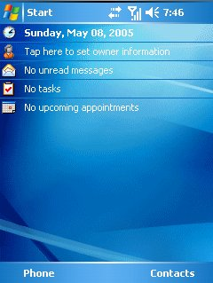
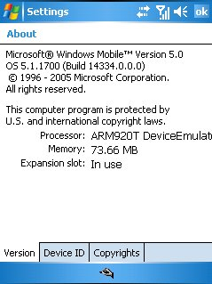
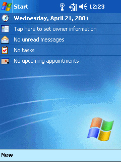
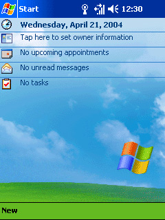
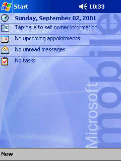
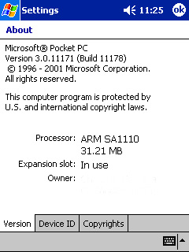
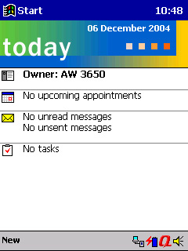

For a long time, Microsoft was quite secretive about the version of operating system installed in your device. It is easy to find out in newer systems, just look in Settings -&gt; System -&gt; About and the first line reveals the required information. However, it was not that easy in some of the older versions, so it might be good to know where to look. The operating systems are ordered from the newest to the oldest for I am going to keep updating this article as new versions are introduced.

## Windows Mobile 5 (Magneto)

Besides a lot of different enhancements, Magneto brings also an unmistakeable 
graphical user interface, characteristic especially by two controls and 
keyboard icon close to the bottom edge of the display. 
It is therefore quite easy to identify.

## Windows Mobile 2003 Second Edition

A much-expected support for the VGA resolution and square displays were
implemented at last (but not many other innovations). The system looks 
exactly like Windows Mobile 2003. For the first time, though, the system 
version number is included in the system information where it is easy to find.

## Windows Mobile 2003 (Ozone)

This was the last "mystery" version without clear identification. 
If you cannot recognise the system in the first two screenshots, 
take a look in the Games folder. Windows Mobile 2003 includes a 
game of bubbles called Jawbreaker along the classic Solitaire - if you have 
it, your system is Windows Mobile 2003.

## Pocket PC 2002 (Merlin)

Pocket PC 2002 was the first major upgrade of Microsoft's operating system for 
pocket devices. It carried a lot of innovations as well as a rehashed 
graphical user interface.

 
## Pocket PC 2000 (Rapier)

And this is where it all started. You cannot mistake this primitive 
graphical user interface for anything else. If you see this 
screen on your PDA, it must be Pocket PC 2000.

And that's all. Microsoft has not offered any more versions of its operating 
system for pocket computers. Well, it actually has but it's been so long 
that your grandfathers' grandfathers were only small boys then :)

Source: [www.pdagold.com](http://www.pdagold.com/articles/detail.asp?a=135)
